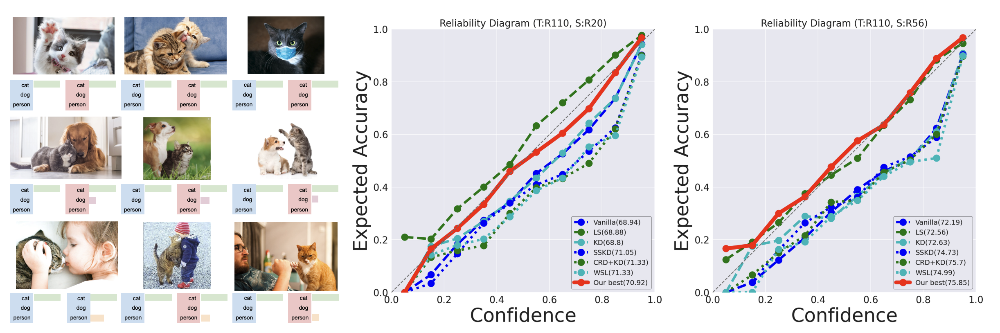
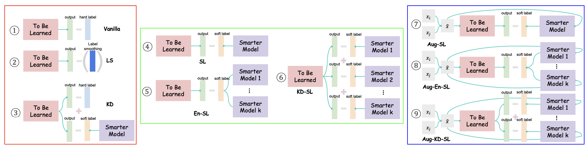

Label Enhancement for Better Model Generalization and Calibration(Under Review CVPR2022)
================================

Concept
-----------

* The difference between the supervision using the hard label (blue box) and the supervision using the soft label (red box)
for image classification. An example of a label enhancement for the cat class at the left is shown, and the graph at the right shows a
comparison of the traditional hard label-based and label enhancement-based classification accuracy and ECE.

Dataset
-------
* Image dataset
  * CIFAR10 (torchvision)
  * CIFAR100 (torchvision)
  * STL10 (torchvision)
  * ImageNet (torchvision)


Algorithm 
---------
* Prev-method
    * vanilla
    * label smoothing

    The label smoothing for the hard label y<sub>i</sub>
    for the same feature input is given as follows:
    and target label is smoothing as much as a value
    where α is the smoothing coefficient, and the probabilities
    for each class except the hard target corresponding to the
    kth class are evenly distributed as α/(K − 1).
    


    * kd
    
* Deterministic Label Enhancement

* Stochastic Label Enhancement



Option 
--------
* method
  * vanllia, kd, label_smoothing, sl, aug-sl등 우리가 돌릴 방법을 선택하는 옵션
* aug_method 
  * 어떠한 data augmentation을 돌려 학습을 진행 할지 선택(mixup, cutmix, ricap)
* smart_model, student_model 
  * teacher model 과 student model 선택 

Training
--------
* SL
```
python main.py --smart_model_path /pretrained/models/resnet110 --is_smart_model --smart_model resnet110 --student_model resnet20 --result ./results --dataset cifar100 --n_class 100 --epochs 240 --lr_decay_epochs=150,180,210 --method sl
```
* Aug-SL+
```
python main.py --smart_model_path /pretrained/models/resnet110 --is_smart_model --smart_model resnet110 --student_model resnet32 --result ./results --dataset cifar100 --n_class 100 --epochs 350 --lr_decay_epochs=150,200,250,300 --method sl --aug_method ricap
```

Experiment
--------
### Comparison with other knowledge transfer methods.
* Preliminaries
    * Knowledge distillation
    * Label smoothing
* Deterministic Label Enhancement
* Stochastic Label Enhancement
 
Classification accuracy (%) and calibration scores (ECE) for ResNet of network architecture for CIFAR100. We omit variation in
ECE, which are not significant differences. All training were performed on 3 different random seeds.
| Teacher 	|      Method     	| Student(# parm) 	|                 	|                 	|                 	|                 	|
|:-------:	|:---------------:	|:---------------:	|:---------------:	|:---------------:	|:---------------:	|:---------------:	|
|         	|                 	| ResNet20(0.27M) 	| Resnet32(0.36M) 	| ResNet44(0.66M) 	| ResNet56(0.85M) 	| ResNet110(1.7M) 	|
|         	|     Vanilla     	|  69.32 / 0.0697 	|  71.17 / 0.094  	|  72.11 / 0.1093 	|  72.28 / 0.123  	|   73.88/ 0.131  	|
|         	| Label smoothing 	|  69.78 / 0.0563 	|  71.49 / 0.032  	|  72.32 / 0.018  	|  72.87 / 0.0197 	|   73.9/ 0.051   	|
|         	|  KD (α=0.1,T=3) 	|  69.07 / 0.071  	|  71.23 / 0.0923 	|  72.19 / 0.108  	|  72.76 / 0.118  	|   73.6/ 0.1347  	|
|         	|        SL       	|  69.9 / 0.0513  	|  71.96 / 0.0713 	|  72.79 / 0.0837 	|  73.59 / 0.0847 	|  75.47 / 0.0893 	|
|         	|      Aug-SL     	|  68.9 / 0.0633  	|  72.17 / 0.0607 	|  73.79 / 0.0367 	|  74.87 / 0.0253 	|  76.56 / 0.0393 	|
|         	|     Aug-SL+     	|  69.41 / 0.0733 	|  72.95 / 0.0535 	|   74.3 / 0.048  	|  75.54 / 0.0283 	|  77.28 / 0.0253 	|
|         	|      En-SL      	|  70.57 / 0.0503 	|  73.0 / 0.0653  	|  73.84 / 0.0723 	|  74.66 / 0.0723 	|  76.39 / 0.071  	|
|         	|      KD-SL      	|  70.75 / 0.0193 	|  73.24 / 0.0203 	|  74.39 / 0.023  	|  74.84 / 0.0233 	|  76.35 / 0.016  	|
|         	|    Aug-En-SL    	|  69.57 / 0.0687 	|  72.64 / 0.0587 	|  73.67 / 0.0493 	|  74.66 / 0.0547 	|  76.08 / 0.0613 	|
|         	|    Aug-KD-SL    	|  69.13 / 0.0823 	|  72.23 / 0.0847 	|   73.51 / 0.08  	|  74.29 / 0.069  	|  76.04 / 0.0877 	|
|         	|    Aug-En-SL+   	|  70.06 / 0.071  	|  72.94 / 0.058  	|  74.47 / 0.0587 	|  75.14 / 0.0685 	|  76.86 / 0.0735 	|
|         	|    Aug-KD-SL+   	|  70.02 / 0.0835 	|  72.58 / 0.102  	|   74.2 / 0.086  	|  75.28 / 0.091  	|  76.48 / 0.0893 	|


### The performance comparison with MAXL[4], another auxiliary learning-based transfer learning method
* The difference between the learning scheduler in MAXL and in our experiment is whether cosine annealing scheduler and focal loss are used or not.
* In VGG16, SSKT showed better performance in all settings. In ResNet20, we also showed better performance in our settings than MAXL in all settings.

 
References
 ----------------
* [1] Hinton et al. - ["Distilling the knowledge in a neural network"](https://arxiv.org/abs/1503.02531) (NIPSW, 2014)
* [2] Ryo Takahashi et al. - ["Data augmentation using random image cropping and patching for deep cnns"](https://arxiv.org/abs/1811.09030) (IEEE Transactions on Circuits and Systems for Video Technology, 2019)
* [3] Chuan Guo et al. - ["On calibration of modern neural networks"](https://arxiv.org/abs/1706.04599) (ICML, 2017)